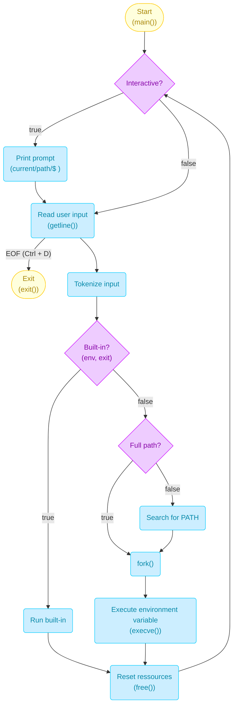

# Simple shell
<small>(See authors in the ```AUTHORS``` file)</small>

## 0. Execution
To start the simple shell, type ```./simple_shell```, or use the interactive mode ```echo "ls -la /root" | ./simple_shell```

## 1. Usage
The simple shell works akin to a true shell with some differences:

### 1.0 Interactive mode
1. The shell creates a child process (with ```fork()```);

2. It waits for an input (```getline()```). If ```Ctrl + D``` is pressed, the simple shell exits with the ```stderr``` of the child process.

3. One shall enter a command (for example : ```ls -la /root``` or ```usr/bin/ls -la /root```). The command name must indeed be the full path to the corresponding binary;

4. The simple shell recognizes the command or the built-in (also searches for its path if not specified ```path_parse()```) and executes it using the newly forked process' environment (see the Managing environments tab below);

5. It loops back to the first step (```while (1)```).

### 1.1 Non interactive mode
1. User enters a command output into the simple shell ```echo "ls -la /root" | ./simple_shell```

2. The simple shell recognizes the command or the built-in (also searches for its path if not specified ```path_parse()```) and executes it using the newly forked process' environment (see the Managing environments tab below);

It has to be noted that **simple shell 0.1** didn't work with arguments (didn't even use tokenizing), and **simple shell 0.2** implemented that functionality.

## 2. Managing environments
### 2.1. Environment used <small>(simple shell ver. 0.3)</small>
The simple shell uses the same environments used in the initial process it is called in, by duplicating it through global variables. However, the environment variable ```PATH``` can be rewritten (only for the simple shell's process), and global built-ins can still be changed by basically rewriting the adding executables to the ```/usr/bin/``` directory.

### 2.2. Check environment (simple shell ver. 1.0)
You might want to check the environment variables and their content. To do so, simply input ```env```

## 3. Close simple shell (simple shell ver. 0.4)
To close the simple shell, simply type the ```exit``` command as-is. It will elways return 0 (SUCCESS).


