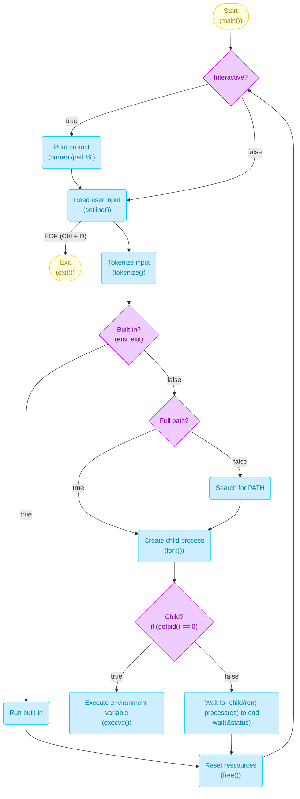

# Simple shell
**Simple shell** is, akin to a shell, an UNIX command line interpreter, used to interact with the operating system with commands, system calls and environment variables.

## 0. Setup
### 0.0. Requirements
* An Ubuntu 20 or later operating system
* GCC (GNU Compiler Collection)
* Git

### 0.1. Installation
* To clone the project repository, input:
```
git clone https://github.com/Ashe2A/holbertonschool-simple_shell.git
```

* To compile the program into the ```simple_shell``` executable, input:
```
gcc -Wall -Werror -Wextra -pedantic -std=gnu89 *.c -o simple_shell
```

## 1. Execution
To start the simple shell, type either of the following :
* **Interactive mode:** ```./simple_shell```
    * Executes the ```simple_shell``` executable, which loops
* **Non interactive mode:** ```echo "ls -la /root" | ./simple_shell```
    * Inputs a command output to the ```simple_shell``` executable, hence not looping

## 2. Usage
### 2.0. Interactive mode

### 2.1. Non interactive mode



<small>(See the project authors in the ```AUTHORS``` file)</small>